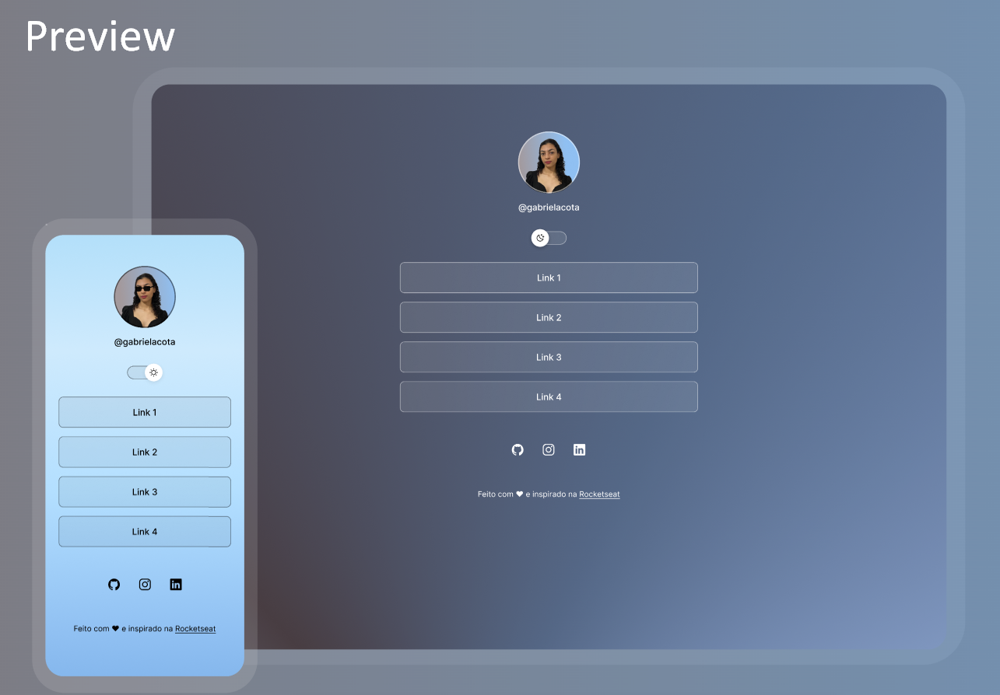

<h1 align="center"> DevLinks </h1>

Programa exclusivo e gratuito, promovido pela Rocketseat para ensino de tecnologias WEB.  
<a href="https://lp.rocketseat.com.br/devlinks/inscricao?utm_source=github&utm_medium=descricao&utm_campaign=capture-devlinks&utm_term=organic&utm_content=descricao-github-mayk-brito">Estude esse projeto em formato de vídeo clicando aqui.</a>

  <a href="#-tecnologias">Tecnologias</a>&nbsp;&nbsp;&nbsp;|&nbsp;&nbsp;&nbsp;
  <a href="#-projeto">Projeto</a>&nbsp;&nbsp;&nbsp;|&nbsp;&nbsp;&nbsp;
   <a href="#-experiencia-pessoal">Experiência Pessoal</a>&nbsp;&nbsp;&nbsp;|&nbsp;&nbsp;&nbsp;
  <a href="#-layout">Layout</a>&nbsp;&nbsp;&nbsp;|&nbsp;&nbsp;&nbsp;
  <a href="#memo-licença">Licença</a>

  

 

  

## 🚀 Tecnologias

Esse projeto foi desenvolvido com as seguintes tecnologias:

- HTML e CSS
- JavaScript
- Git e Github
- Figma

## 💻 Projeto

Para ter acesso ao conteúdo que utilizei para estudo, basta navegar este link:

- [Assistir aulas](https://lp.rocketseat.com.br/devlinks/inscricao?utm_source=github&utm_medium=descricao&utm_campaign=capture-devlinks&utm_term=organic&utm_content=descricao-github-mayk-brito)

## 👨‍💻 Experiência pessoal

Durante o desenvolvimento, aprendi:

- A trabalhar com `HTML`, `CSS` e boas práticas de semântica.
- Diferenças entre elementos `inline` e `block` e 'flex'.
- Como centralizar elementos usando `text-align`, `margin: auto`, `display: flex` com `justify-content` e `align-items`.
- Como aplicar animações com `forwards` para manter as propriedades finais.
- O uso de `background-size: cover` vs `contain` e a shorthand para `background`.
- O uso do Google Fonts para tipografia (link: https://fonts.google.com/).
- O uso do site ionicons para os ícones do projeto (link: https://ionic.io/ionicons).

Além disso, pude ter contato com conceitos de layout responsivo e práticas modernas com `flexbox`, além de entender melhor o comportamento de elementos `inline` e como tratá-los para centralização. Também explorei hover effects e transições suaves para melhorar a interação com o usuário.

## 🔖 Layout

Você pode visualizar o layout do projeto através [DESSE LINK](https://www.figma.com/community/file/1187422022288947321). É necessário ter conta no [Figma](https://figma.com) para acessá-lo.

## :memo: Licença

Esse projeto está sob a licença MIT.

---

Feito com base nos materiais e aulas do Rocketseat ♥ :wave: [Participe da comunidade!](https://discord.gg/rocketseat)
